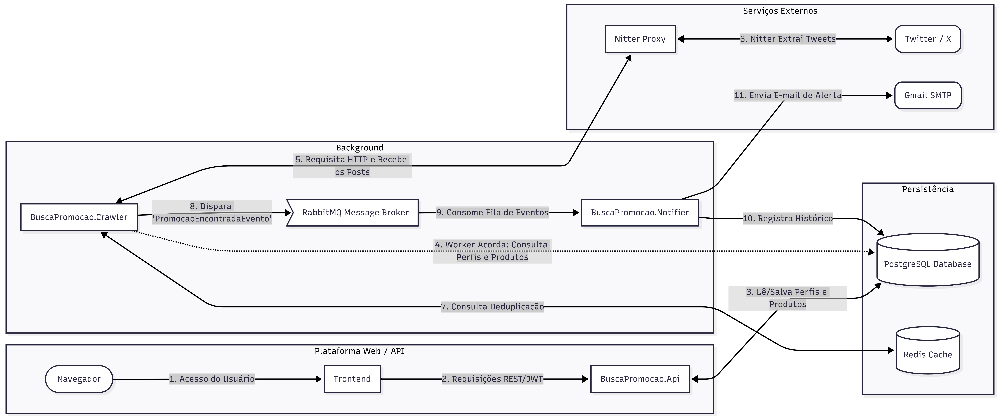

# Busca Promoção

Sistema automatizado de monitoramento de promoções no X (Twitter). Você cadastra perfis e produtos, o sistema rastreia os feeds, detecta promoções e te notifica por e-mail e pela aplicação em tempo real. Também é possível disparar uma busca imediata: o sistema varre os posts já publicados pelos perfis monitorados e retorna os que contêm seu produto em promoção.

---

## Como funciona

```
Usuário cadastra perfis (@handle) e produtos (ex: "Controle PS4")
        ↓
Crawler acorda a cada x minutos e lê os feeds via Nitter (RSS)
        ↓
Encontrou tweet com palavra-chave? Verifica no Redis se já foi processado
        ↓
Novo tweet → publica evento no RabbitMQ
        ↓
Notifier consome o evento → salva notificação no banco + envia e-mail HTML
        ↓
Dashboard exibe os alertas em tempo real
```

---

## Arquitetura



O projeto é composto por **4 microsserviços** independentes:

| Serviço | Tecnologia | Responsabilidade |
| :--- | :--- | :--- |
| **API** | .NET 9 + ASP.NET Core | Endpoints REST para o frontend (auth, produtos, perfis, alertas) |
| **Crawler** | .NET 9 Worker Service | Scraping dos feeds do X/Twitter via Nitter, deduplicação via Redis |
| **Notifier** | .NET 9 Worker Service | Consome fila do RabbitMQ, salva notificação e envia e-mail |
| **Frontend** | Angular 17 + Nginx | Interface web SPA servida pelo Nginx |

**Stack de backend:**
- Clean Architecture (Domain → Application → Infrastructure → API)
- CQRS com MediatR (Commands e Queries isolados por Handler)
- Entity Framework Core 9 com Migrations automáticas
- Autenticação JWT + senhas com BCrypt
- MailKit para envio de e-mails HTML via SMTP

---

## Pré-requisitos

- [Docker Desktop](https://www.docker.com/products/docker-desktop/) instalado e em execução

Não é necessário instalar .NET, Node.js, PostgreSQL ou qualquer outra dependência — tudo roda dentro dos containers.

---

## Configuração

**1. Crie o arquivo `.env`** na raiz do projeto (copie o exemplo abaixo):

```env
POSTGRES_USER=seu_usuario
POSTGRES_PASSWORD=sua_senha
POSTGRES_DB=busca_promocao_db

RABBITMQ_USER=seu_usuario
RABBITMQ_PASSWORD=sua_senha

EMAIL_SMTP_HOST=smtp.gmail.com
EMAIL_SMTP_PORT=587
EMAIL_USER=seu_email@gmail.com
EMAIL_PASS=sua_app_password_gmail
```

> **Gmail App Password:** acesse [myaccount.google.com/apppasswords](https://myaccount.google.com/apppasswords) e gere uma senha de app para "Outro aplicativo". Use essa senha no campo `EMAIL_PASS`.

---

## Executando o projeto

```bash
# Primeira execução (ou após mudanças no código)
docker compose up -d --build

# Execuções seguintes
docker compose up -d
```

Aguarde todos os containers inicializarem (~30 segundos na primeira vez).

---

## Acessos

| Interface | URL |
| :--- | :--- |
| **Aplicação** | http://localhost:4200 |
| **API (Swagger)** | http://localhost:5247/swagger |
| **RabbitMQ (painel)** | http://localhost:15672 |

---

## Comandos úteis

```bash
# Ver status de todos os containers
docker compose ps

# Ver logs em tempo real de um serviço
docker compose logs -f crawler
docker compose logs -f notifier
docker compose logs -f api

# Parar todos os containers
docker compose down

# Parar e remover volumes (reseta o banco de dados)
docker compose down -v

# Rebuild de um serviço específico
docker compose up -d --build api
docker compose up -d --build frontend
```

---

## Estrutura do repositório

```
busca-promocoes/
├── docker-compose.yml
├── .env                          # credenciais (não versionado)
├── nitter.conf                   # configuração do Nitter
├── busca-promocao-back/
│   ├── BuscaPromocao.Domain/     # entidades e regras de negócio
│   ├── BuscaPromocao.Application/# casos de uso (CQRS / MediatR)
│   ├── BuscaPromocao.Infrastructure/ # EF Core, repositórios, serviços externos
│   ├── BuscaPromocao.Api/        # controllers REST + autenticação JWT
│   ├── BuscaPromocao.Crawler/    # worker de scraping (Nitter + Redis)
│   └── BuscaPromocao.Notifier/   # worker de notificações (RabbitMQ + MailKit)
└── busca-promocao-front/
    └── src/app/
        ├── features/             # telas: dashboard, perfis, produtos, alertas
        ├── core/services/        # serviços HTTP (Angular)
        └── layout/               # sidebar e estrutura principal
```

---


